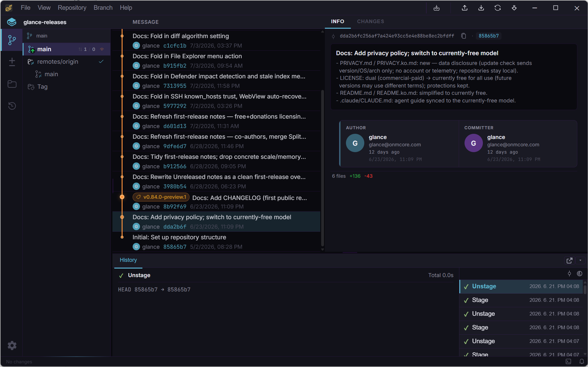

# Glance 매뉴얼

[English](README.md) | [한글](README.ko.md)

Glance 사용법을 간단하고 실용적으로 정리한 문서입니다. 다른 Git GUI를 써봤다면 금방 익숙해질 겁니다 — 이 매뉴얼은 주로 "어디에 뭐가 있는지"와 "뭐가 다른지"를 다룹니다.

## 목차

1. [시작하기](getting-started.ko.md) — 설치, 저장소 열기/clone, 인터페이스 둘러보기
2. [핵심 워크플로우](workflows.ko.md) — 히스토리, 스테이징, 브랜치, 리모트, SSH, diff, Timeline
3. [단축키](shortcuts.ko.md)
4. [문제 해결](troubleshooting.ko.md) — 업데이트 채널, 내장 복구 기능, 버그 리포트

## 인터페이스 한 문단 요약

왼쪽 사이드바에는 5개 탭이 있습니다: **Branches**(커밋 히스토리·그래프), **Changes**(스테이징 영역), **File Explorer**(저장소 파일 트리), **Timeline**(reflog 기반 히스토리·되돌리기), 그리고 하단의 **Settings**. 커밋·브랜치·파일을 선택하면 오른쪽 패널에 상세 내용이 열립니다.

여기 없는 내용은 메인 [README](../../README.ko.md)를 참고하거나, 빠지거나 잘못된 부분이 있으면 [이슈를 열어](https://github.com/onmcore/glance-releases/issues/new) 알려주세요.
