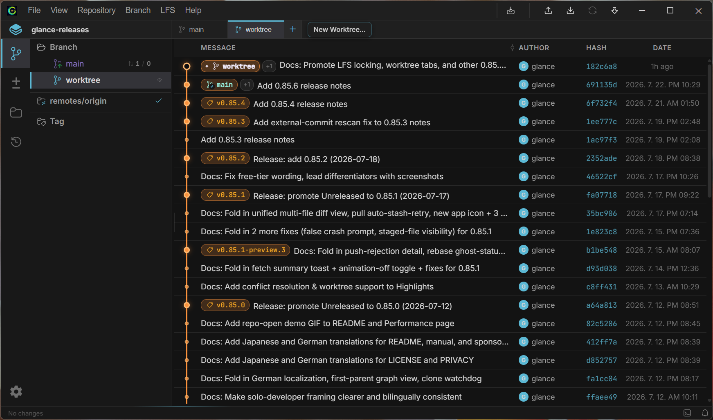
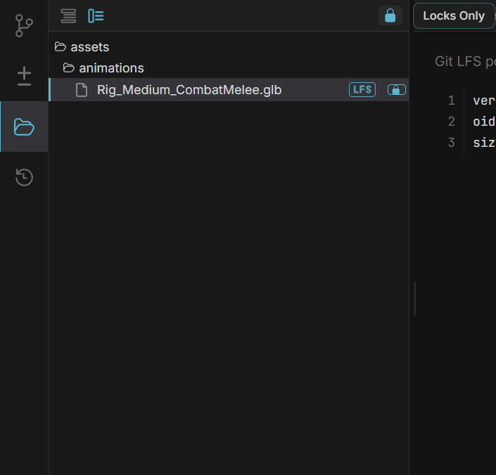

# コアワークフロー

[English](workflows.md) | [한글](workflows.ko.md) | [日本語](workflows.ja.md) | [Deutsch](workflows.de.md)

## 履歴を参照する

**Branches** タブはコミットグラフを表示します — 仮想化されたリストなので、何十万個のコミットがあっても滑らかにスクロール可能です。サイドバーの refs ツリーにはブランチ・リモート・タグ・stash が表示され、いずれかを選択するとグラフがフィルタされるか、その位置にジャンプします。

- `Ctrl+F` で検索を開く — コミットをメッセージ・作成者・ハッシュでフィルタリング
- コミットを右クリックしてアクション実行：チェックアウト、ブランチ作成、cherry-pick、reset、比較、パッチとしてエクスポート、新しいウィンドウで開く
- **All Branches** をトグルすると、現在のブランチの祖先だけではなく、履歴全体を1つのフラットリストで表示
- コミットにホバーするとクイックプレビューが表示され、クリックすると右パネルで詳細（Info / Changes タブ）を表示
- **新しいウィンドウで開く** でコミット詳細をポップアップウィンドウで表示すれば、メインウィンドウで履歴を参照したまま比較できます

### リセット

コミットを右クリック → **Reset to this commit** で現在のブランチをそのコミットに移動できます：

- **Soft** — ブランチポインタのみを移動します。ワーキングディレクトリと staged 変更はそのままです
- **Mixed** — ポインタを移動してインデックスを更新しますが、ワーキングディレクトリのファイルはそのままです
- **Hard** — ポインタ・インデックス・ワーキングディレクトリすべてをそのコミットに合わせて書き直します（コミットされていない変更は破棄されます — 追跡されていないファイルは変更されません）

hard reset がうまくいかなかった場合、[Timeline](#timeline) を使うことでほぼすべて復旧できます。

## ステージング & コミット

**Changes** タブはワーキングディレクトリのステージング領域で、**Staged**・**Unstaged**・（存在する場合）**Conflicts** セクションに分かれています。大きな変更セットを参照する方法に応じて、Flat・Grouped・Tree レイアウトを切り替えられます。

- diff パネルはファイルを1つずつ開く代わりに、変更されたすべてのファイルを1つの連続スクロールで表示します — unified と split レイアウトを切り替え、複数行をドラッグして一度に stage または discard できます
- ファイルまたはフォルダのチェックボックスで stage/unstage — `Ctrl`/`Shift` 複数選択に対応
- 破棄はファイル・hunk・ドラッグした行範囲のレベルで可能
- バイナリファイルは diff の代わりにサイズカードで表示されます
- 単語単位のハイライトで行の中でどの文字が変わったかを正確に表示；CSV/TSV diff は列ごとに色を付け、コード diff にはネストの深さを示すインデントガイドが表示されます
- Git LFS で追跡されていない大きなバイナリファイルにはバッジが表示され、クリック1つで `.gitattributes` に追加する **Track with LFS** アクションが提供されます — サイズ基準と、この検査を実行するかどうかは Settings で調整可能
- パネル下部にコミットメッセージを記述して `Ctrl+Enter` で送信
- diff ヘッダーには各ファイルのエンコード（UTF-8・EUC-KR など）と行終わり（LF/CRLF）が表示されます。unstaged ワーキングコピーファイルの場合、チップをクリックして変換可能

変更はファイルウォッチャーがリアルタイムで検出します — 手動で更新する必要はありません。この統合マルチファイルビューは、コミット詳細の **Changes** タブにも同じように表示されるため、履歴を確認する方法がワーキングディレクトリを確認する方法と同じになります。

### 共著者 & 署名

コミットメッセージ上のギアアイコン（⚙）で以下が可能です：

- **Co-authors** — 名前/メールアドレスで貢献者を追加するモーダルを開きます（最近の貢献者から自動補完に対応）。コミット時に `Co-authored-by` トレーラーとして追加されます
- **Sign commit** — 設定された Git 署名キー（SSH または GPG）で署名します。暗号化されていない/パスフレーズなし SSH キーはプロセス内で署名され、GPG またはパスフレーズ保護されたキーはシステムの `git`/`gpg-agent` 設定にフォールバック

### 修正

コミットパネルの **Amend** トグルをオンにすると、新しいコミットを作成する代わりに staged 変更を前のコミットに追加できます。メッセージと作成者はそのコミットから事前に入力され、Staged セクションには修正対象となるコミットの内容が表示されます — `HEAD` に既にある行は読み取り専用で、ファイルを unstage すると修正対象から削除

## ブランチング & マージング

サイドバーまたは Branch メニューからブランチを作成・チェックアウト・名前変更・削除できます。チェックアウトは大規模リポジトリの進行状況を表示し、実際に変更されたパスのみにアクセスします。Windows では、checkout・pull・push・rebase・sync など長時間実行される操作の進行状況が、ウィンドウを最小化してもタスクバーのアイコンに表示されます。

- **Merge** — 現在のブランチに別のブランチをマージ（fast-forward または実際のマージコミット）；競合が発生した場合は Merge Editor が開きます
- **Rebase onto** — ブランチまたはコミット上に rebase — フェーズごとの進行状況を表示（チェックアウト・コミット再生など）；ブランチに upstream が設定されている場合、コンテキストメニューからクリック1つで **Rebase onto upstream** も可能
- **Cherry-pick** — コンテキストメニューから現在のブランチに commit をチェリーピック
- **Tags** — 個別に作成・削除・プッシュ可能；注釈付きタグメッセージはインラインで表示可能

### Stash

Branch メニューから **Stash Changes...** でコミットされていない変更を保存でき、オプションで staged 変更をワーキングツリーに保持できます。Stash はサイドバーの Stashes セクションとコミットグラフに表示されます。各 stash は以下に対応：

- **Pop** — 適用して削除
- **Apply** — 適用するが stash は保持
- **Drop** — 適用せずに削除

### 競合を解決

マージ・rebase・cherry-pick 中に競合が発生すると、Glance は **Merge Editor** を開きます — 3 方向ビュー（Ours / Base / Theirs）で、`[` / `]` で競合間を移動します。解決してから同じビューで続行または操作を中止できます。

外部ツール（Beyond Compare・WinMerge・KDiff3 など）を使用したい場合は、Settings で設定してください — Glance は組み込みビューの代わりにそのツールで diff と競合を開きます。

## リモート同期

サイドバーからリモートを追加・編集・削除します。Fetch はオンデマンドで実行するか、バックグラウンドで自動実行できます（デフォルトは 3 分ごと — Settings で調整可能）。実行後は結果トーストが表示され、新規・更新・削除されたブランチとタグが分かります — 複数のリモートの結果も1枚のカードにまとめられます。Push は force と force-with-lease に対応しています。Pull はマージ（fast-forward または 3 方向、競合解決を含む）または rebase を選択できます。コミットされていない変更が Pull を妨げる場合、Glance は自動的にそれを stash してから再試行し、完了後に復元することも提案します — Pull の戦略やエンジンに関わらず動作し、再試行しても解決しない場合は元に戻します。

### SSHリモート

SSH ベースの clone/fetch/push の場合、**Settings → SSH Keys** でキーを設定してください：

1. **キーを生成** — アルゴリズムを選択（Ed25519 推奨）して、名前を付けて作成
2. 公開キーを Git ホスト（GitHub/GitLab など）にコピー
3. **Host configuration** でホストエントリを追加（HostName・User・Port・IdentityFile） — これは実際の `~/.ssh/config` を編集するため、既存エントリと Glance が知らない指令は保存
4. 新しいホストに初めて接続するとき、Glance は SSH ホストキーの信頼（TOFU）を **Known hosts** で求めます — `ssh` の初回接続プロンプトと同じ方式

## 高度な機能

### ワークツリー

Worktree はタイトルバー下のストリップにタブとして、現在のリポジトリの隣に表示されます — 現在のチェックアウトに影響を与えずに2つのことを同時に作業するときに便利です。**+** をクリックして追加：開始ブランチ・対象フォルダ・名前を選択します（パスはデフォルトで `<フォルダ>/<ブランチ>` で、作成前に編集可能）。タブをクリックすると即座に切り替わり、右クリックで削除できます（現在いるワークツリーは削除不可）。ストリップに入りきらないほど worktree が多い場合は、"+N" ボタンで残りを表示できます。

### サブモジュール

サブモジュールはサイドバーに表示されます。初期化されていないものは **Init** ボタンがあり、初期化されたものはクリックで独自リポジトリとして開き、右クリックメニューから更新できます。

### パッチ

共有リモートなしで変更を共有する場合、コミットを右クリック（またはドラッグで範囲選択）→ **Export as patch** を使用します。後で Repository メニューの **Apply patch** で適用します。これは `git am` より `git apply` に近いもので、ワーキングツリーのみを更新するため、stage とコミットは自分で行う必要があります。

### Diff アルゴリズム

特定の diff が期待と異なって表示される場合、**Settings → Editor** で diff アルゴリズムを Histogram（デフォルト）・Myers・Minimal から切り替え可能

## Ref を比較

コミット・ブランチ・タグを右クリックして **Compare** を選択すると、現在のチェックアウトに関係なく 2 つの任意の ref 間のファイルレベル diff を表示できます。2 点（`a..b`）と 3 点（`a...b`・マージベース）比較を切り替え、両側を入れ替え可能

## ファイルを探索

**File Explorer** タブはリポジトリ全体のツリー（変更されたファイルだけではない）を Flat・Grouped・Tree レイアウトで参照できます。ファイルを開くとシンタックスハイライト付きで内容を表示；Markdown ファイルは raw/レンダリングプレビューを切り替え可能、CSV/TSV ファイルは raw テキストとソート可能でクリッカブルなヘッダのテーブルを切り替え可能

ファイルのコンテキストメニューから **history**（そのファイルに触れたすべてのコミット）または **blame**（行ごとの作成者/コミット注釈）も参照できます。

Git LFS で追跡されるファイルはツリーにバッジが表示されます。Glance の LFS サポートはネイティブな純 Rust クライアント — 外部の `git-lfs` バイナリは不要 — ポインタファイルと実際のコンテンツを自動的に変換し、ファイル1つずつではなくチェックアウト・リセット・discard 時に1回のバッチリクエストで不足しているコンテンツをダウンロードし、LFS で追跡されるイメージをオンデマンドでインラインプレビュー、大容量転送時には進行状況も表示します。`.gitattributes` に `filter=lfs` が設定されていれば、追加の設定は不要です。独自の `git-lfs` CLI でダウンロードを処理したい場合は、Settings でそのように設定することも可能です。

ファイルロック機能も組み込まれています：File Explorer または Changes パネルのコンテキストメニューから、LFS で追跡されるファイルをロック・アンロック（他の人のロックを強制解除することも可能）でき、どちらのリストもロック済みファイルのみにフィルタリングできます。ロックバッジがどのファイルが現在ロックされているかを表示します。

## Timeline

**Timeline** タブはリポジトリの reflog を年代順に表示します — チェックアウト・コミット・マージ・rebase・reset・pull など、HEAD が指していたすべての場所です。見えるブランチ履歴とは無関係に動作する安全網です。どのエントリからでも以下が可能：

- その地点に直接 **チェックアウト**
- その地点から新しい **ブランチを作成**
- そのコミットを現在のブランチに **cherry-pick**
- 現在のブランチをその地点に **リセット**
- Timeline を使ってミスを修正したばかりの場合、最後の復旧アクションを **undo**

---

次へ：[キーボードショートカット](shortcuts.ja.md)
