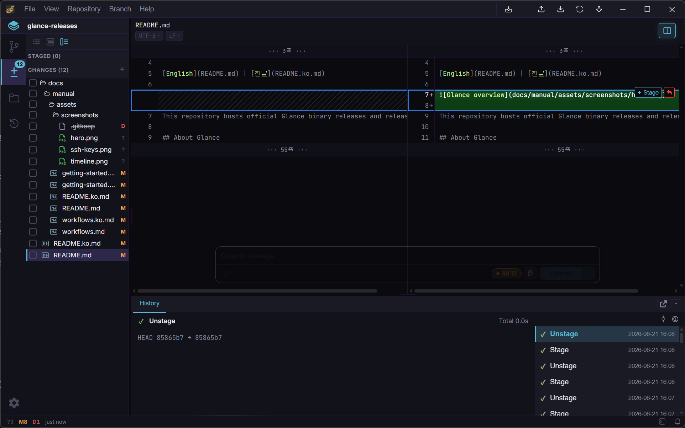
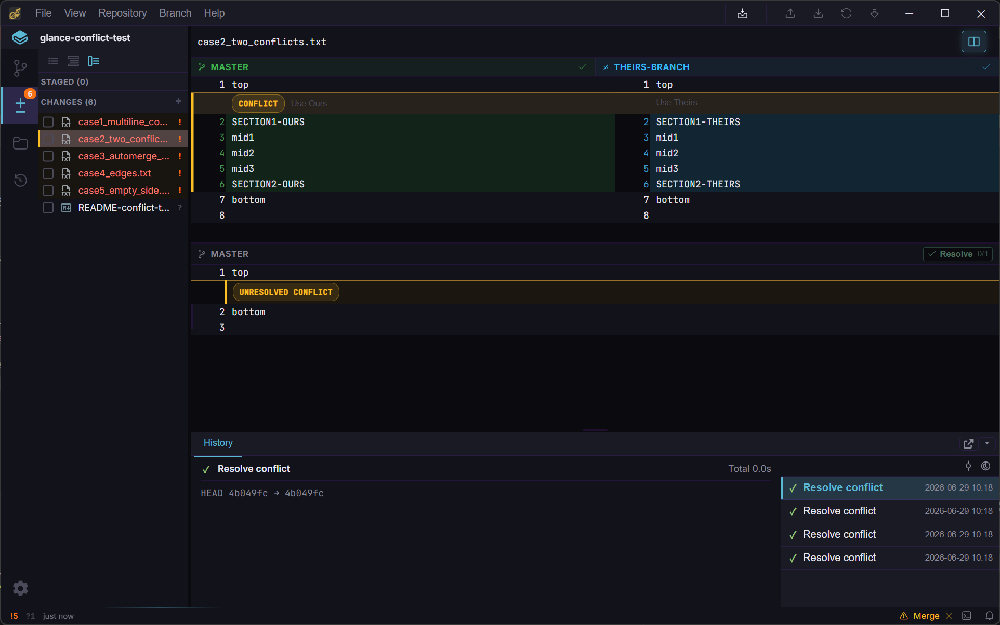
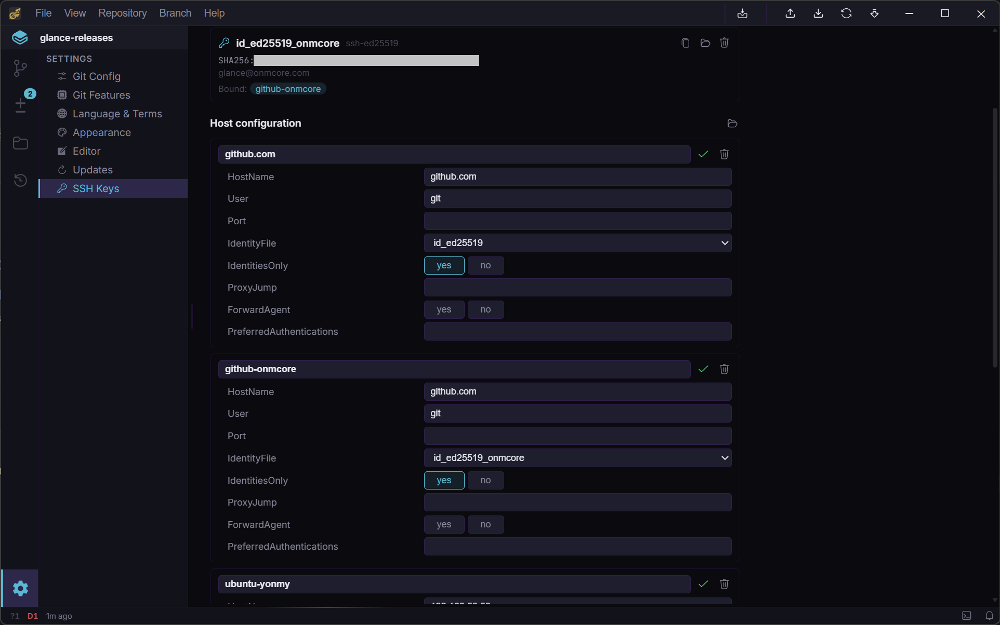
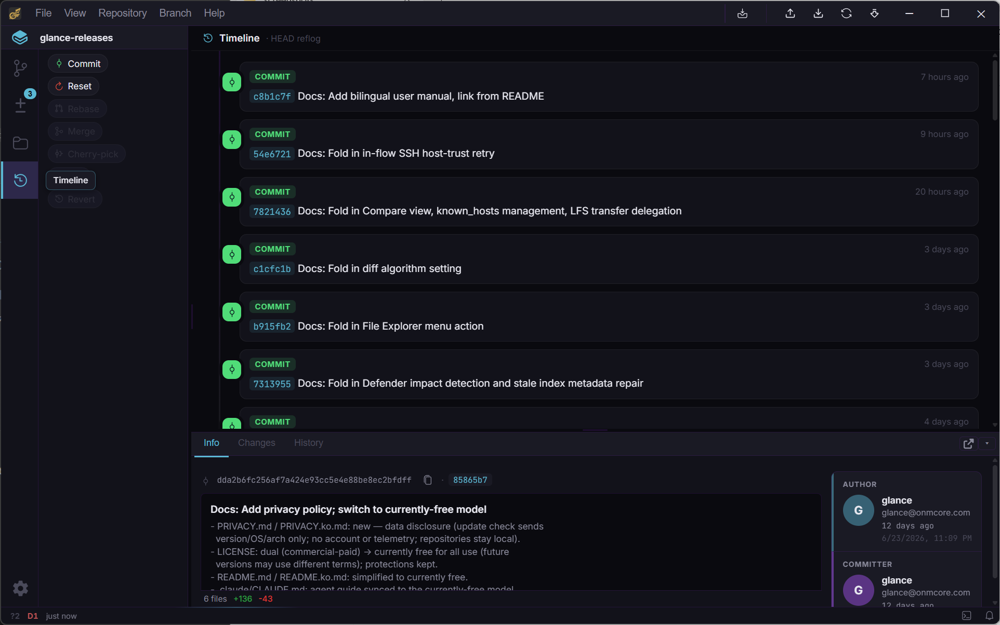

# 핵심 워크플로우

[English](workflows.md) | [한글](workflows.ko.md)

## 히스토리 보기

**Branches** 탭에서 커밋 그래프를 볼 수 있습니다 — 가상화된 리스트라 수십만 개 커밋에서도 부드럽게 스크롤됩니다. 사이드바의 refs 트리에는 브랜치·리모트·태그·stash가 나열되며, 하나를 선택하면 그래프가 필터되거나 해당 위치로 이동합니다.

- `Ctrl+F`로 검색 열기 — 메시지·작성자·해시로 커밋 필터링
- 커밋 우클릭으로 체크아웃, 브랜치 생성, cherry-pick, reset, compare 등 실행
- **All Branches** 토글로 현재 브랜치 조상 커밋만이 아니라 전체 히스토리를 하나의 리스트로 보기
- 커밋에 마우스를 올리면 미리보기, 클릭하면 오른쪽 패널에 상세(Info / Changes 탭) 표시

## 스테이징 & 커밋

**Changes** 탭은 워킹 디렉토리 스테이징 영역으로, **Staged** / **Unstaged** / (있는 경우) **Conflicts** 섹션으로 나뉩니다. 변경량이 많을 때 보기 편하도록 Flat / Grouped / Tree 레이아웃을 전환할 수 있습니다.

- 파일이나 폴더 체크박스로 stage/unstage — `Ctrl`/`Shift` 다중 선택 지원
- 파일 전체가 아니라 diff를 열어 개별 hunk나 라인 단위로 stage/discard 가능
- Discard도 파일 또는 hunk 단위로 가능
- 아래 패널에 커밋 메시지를 쓰고 `Ctrl+Enter`로 제출

변경 사항은 파일 워처가 실시간으로 감지합니다 — 수동 새로고침 불필요.

## 브랜치 & 머지

사이드바나 Branch 메뉴에서 브랜치를 생성·체크아웃·이름변경·삭제할 수 있습니다. 체크아웃은 대형 저장소에서 진행률을 보여주며, 실제 변경된 경로만 건드립니다.

- **Merge** — 현재 브랜치에 다른 브랜치를 병합 (fast-forward 또는 실제 머지 커밋); 충돌이 있으면 Merge Editor가 열립니다
- **Rebase onto** — 브랜치나 커밋 위로 rebase — 단계별(체크아웃, 커밋 재생 등) 진행 상황 표시
- **Cherry-pick** — 커밋 컨텍스트 메뉴에서 현재 브랜치로 cherry-pick
- **태그** — 개별 생성·삭제·푸시 가능, annotated 태그 메시지는 인라인으로 확인 가능

### Stash

Branch 메뉴의 **Stash Changes...**로 커밋되지 않은 변경사항을 보관하며, staged 변경을 워킹 트리에 남겨둘지 선택할 수 있습니다. Stash는 사이드바의 Stashes 섹션과 커밋 그래프에 표시됩니다. 각 stash는 다음을 지원합니다:

- **Pop** — 적용 후 제거
- **Apply** — 적용하되 stash는 유지
- **Drop** — 적용 없이 삭제

### 충돌 해결

Merge, rebase, cherry-pick 중 충돌이 나면 Glance가 **Merge Editor**를 엽니다 — 3-way 뷰(Ours / Base / Theirs)이고 `[` / `]`로 충돌 사이를 이동합니다. 해결 후 같은 화면에서 계속하거나 작업을 중단(abort)할 수 있습니다.

## 리모트 동기화

사이드바에서 리모트를 추가·수정·삭제할 수 있습니다. Fetch는 수동 실행하거나 백그라운드에서 자동 실행됩니다(기본 3분 간격 — Settings에서 조정 가능). Push는 force와 force-with-lease를 지원합니다. Pull은 merge(fast-forward 또는 3-way, 충돌 해결 포함) 또는 rebase 방식을 선택할 수 있습니다.

### SSH 리모트

SSH 기반 clone/fetch/push를 쓰려면 **Settings → SSH Keys**에서 키를 먼저 설정하세요:

1. **Generate a key** — 알고리즘 선택(Ed25519 권장), 이름 지정 후 생성
2. 공개 키를 GitHub/GitLab 등 Git 호스트에 등록
3. **Host configuration**에서 호스트 항목 추가(HostName, User, Port, IdentityFile) — 실제 `~/.ssh/config`를 편집하는 것이므로, 기존 항목이나 Glance가 모르는 지시어도 그대로 보존됩니다
4. 새 호스트에 처음 연결하면 Glance가 SSH 호스트 키 신뢰(TOFU)를 **Known hosts**에서 물어봅니다 — `ssh` 최초 연결 시 뜨는 확인창과 같은 개념입니다

## 두 ref 비교

커밋·브랜치·태그를 우클릭해 **Compare**를 선택하면, 현재 체크아웃 상태와 무관하게 임의의 두 ref 사이 파일 단위 diff를 볼 수 있습니다. 2-dot(`a..b`)과 3-dot(`a...b`, merge-base 기준) 비교를 전환하고 양쪽을 바꿀 수 있습니다.

## 파일 탐색

**File Explorer** 탭은 (변경 여부와 무관하게) 저장소 전체 파일 트리를 Flat / Grouped / Tree 레이아웃으로 보여줍니다. 파일을 열면 문법 강조가 적용된 내용이 표시되고, Markdown은 원본/렌더링 미리보기를 전환할 수 있으며, CSV는 원본 텍스트와 정렬 가능한 표를 전환할 수 있습니다.

파일 컨텍스트 메뉴에서 **history**(그 파일을 건드린 모든 커밋)나 **blame**(라인별 작성자·커밋 주석)도 볼 수 있습니다.

## Timeline

**Timeline** 탭은 저장소 reflog를 시간순으로 보여줍니다 — checkout, commit, merge, rebase, reset, pull 등 HEAD가 거쳐온 모든 지점입니다. 눈에 보이는 브랜치 히스토리와 별개로 동작하는 안전망입니다. 각 항목에서:

- 해당 지점으로 바로 **checkout**
- 해당 지점에서 **새 브랜치** 생성
- 해당 커밋을 현재 브랜치로 **cherry-pick**
- 현재 브랜치를 해당 지점으로 **reset**
- 방금 Timeline으로 실수를 복구했다면 마지막 복구 동작을 **undo**

---

다음: [단축키](shortcuts.ko.md)
