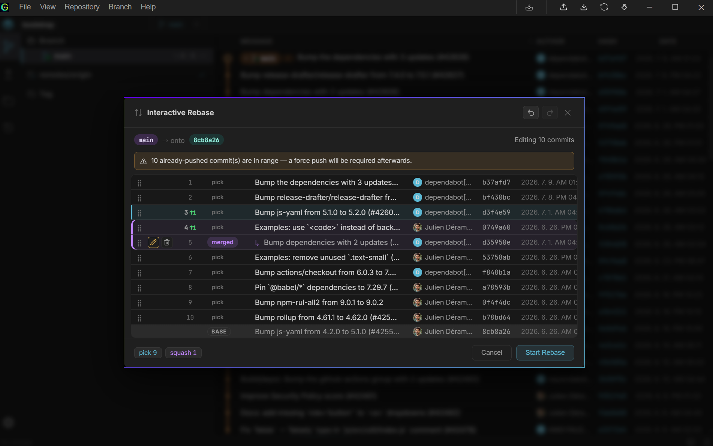
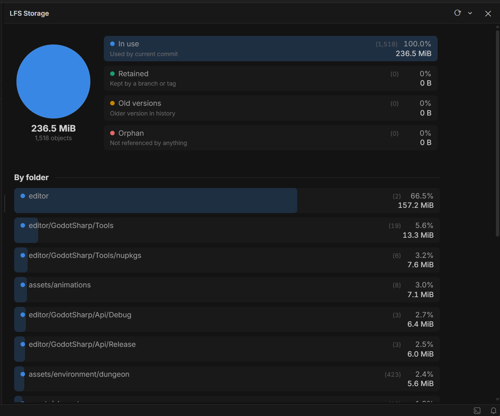

# Core Workflows

[English](workflows.md) | [한글](workflows.ko.md) | [日本語](workflows.ja.md) | [Deutsch](workflows.de.md)

## Browsing history

The **Branches** tab shows the commit graph — a virtualized list that stays smooth even at hundreds of thousands of commits. The sidebar's refs tree lists branches, remotes, tags, and stashes; selecting one filters or jumps the graph.

- `Ctrl+F` opens search — filter commits by message, author, or hash
- Right-click a commit for actions: checkout, create branch, cherry-pick, reset, compare, export as patch, or open in a new window
- Toggle **All Branches** to see the entire history as one flat list instead of just the current branch's ancestry
- Hovering a commit shows a quick preview; clicking opens full details (Info / Changes tabs) in the right panel
- **Open in new window** pops a commit's detail view into its own window, so you can keep browsing history in the main window while comparing

### Resetting

Right-click a commit → **Reset to this commit** to move the current branch there:

- **Soft** — moves the branch pointer only; your working directory and staged changes are untouched
- **Mixed** — moves the pointer and updates the index, but leaves working directory files as they are
- **Hard** — moves the pointer and rewrites the index and working directory to match (discards uncommitted changes — untracked files are left alone)

If a hard reset goes wrong, [Timeline](#timeline) can usually get you back.

## Staging & committing

The **Changes** tab is your working directory staging area, split into **Staged**, **Unstaged**, and **Conflicts** (when present) sections. Switch between Flat, Grouped, and Tree layouts depending on how you like to scan a large changeset.

- The diff panel shows every changed file in one continuous scroll instead of opening them one at a time — toggle between unified and split layouts, and drag across lines to stage or discard a range at once
- Check a file or folder to stage/unstage it; checkboxes support `Ctrl`/`Shift` multi-select
- Discard is available at the file, hunk, or line-range level
- Binary files show a size card instead of a diff
- Word-level highlighting marks exactly which characters changed within a line; CSV/TSV diffs color each column separately; indent guides mark nesting depth in code diffs
- A badge flags large binary files that aren't tracked by Git LFS, with a one-click **Track with LFS** action to add them to `.gitattributes`; the size threshold — and whether this check runs at all — is configurable in Settings
- Write your commit message in the panel below and submit with `Ctrl+Enter`
- The diff header shows each file's encoding (UTF-8, EUC-KR, etc.) and line ending (LF/CRLF); for unstaged working-copy files, clicking either chip lets you convert it

Changes are detected in real time by a file watcher — no manual refresh needed. The same unified multi-file view also appears in a commit's **Changes** tab, so reviewing history works the same way as reviewing your working directory.

### Co-authors and signing

The gear icon (⚙) above the commit message adds:

- **Co-authors** — opens a modal to add contributors by name/email (with autocomplete from recent contributors); they're appended as `Co-authored-by` trailers when you commit
- **Sign commit** — signs with your configured Git signing key (SSH or GPG). Unencrypted/passphrase-less SSH keys are signed in-process; GPG or passphrase-protected keys fall back to your system's `git`/`gpg-agent` setup

### Amending

Toggle **Amend** in the commit panel to fold your staged changes into the previous commit instead of creating a new one. The message and author pre-fill from that commit, and the Staged section shows what the amended commit will contain — lines already in `HEAD` are read-only, and unstaging a file removes it from the amend.

## Branching & merging

Create, checkout, rename, and delete branches from the sidebar or the Branch menu. Checkout shows progress for large repos and only touches the paths that actually changed; on Windows, long-running operations (checkout, pull, push, rebase, sync, and more) also show progress on the taskbar icon, even while the window is minimized.

- **Merge** a branch into the current one (fast-forward or a real merge commit); conflicts, if any, open the Merge Editor
- **Rebase onto** a branch or commit — progress is shown phase-by-phase (checking out, replaying commits, etc.); if the branch has an upstream configured, its context menu also offers a one-click **Rebase onto upstream**
- **Cherry-pick** a commit onto the current branch from its context menu
- **Tags** can be created, deleted, and pushed individually; annotated tag messages are viewable inline

### Interactive rebase

Right-click a commit → **Edit history from this commit** (or a branch → **Interactive Rebase…**, which rebases onto that branch while editing) to open a list of the commits above it that you can reorder, combine, or edit before they're replayed. You can also drag a commit directly in the log — drop it on the edge of another row to reorder, or in the middle to squash it into the row below.

For each commit, choose:

- **Pick** — keep as-is
- **Reword** — keep the changes, edit the message
- **Squash** — combine into the previous commit, merging both messages
- **Fixup** — combine into the previous commit, discarding this one's message
- **Drop** — remove the commit entirely

Drag rows to reorder them (or use `Alt+↑`/`Alt+↓` with a row focused), and undo/redo (`Ctrl+Z` / `Ctrl+Y`) while the plan is still open. If replaying hits a conflict, the usual conflict-resolution flow handles it — continue or abort from there.

A few things it doesn't do yet: editing a commit's contents mid-rebase, running custom commands, rebasing the repository's very first commit, auto-squashing `fixup!`/`squash!` commits, or updating dependent branches. It's also not available in a linked worktree, and a rebase range is capped at 1,000 commits.

### Stashing

Stash uncommitted changes from the Branch menu (**Stash Changes...**), optionally keeping staged changes in the working tree. Stashes appear in the sidebar's Stashes section and in the commit graph. Each stash supports:

- **Pop** — apply and remove
- **Apply** — apply but keep the stash
- **Drop** — delete without applying

### Resolving conflicts

Whenever a merge, rebase, or cherry-pick hits a conflict, Glance opens the **Merge Editor** — a three-way view (Ours / Base / Theirs) with `[` / `]` to jump between conflicts. Resolve, then continue or abort the operation from the same view.

If you'd rather use an external tool (Beyond Compare, WinMerge, KDiff3, and similar), configure it in Settings — Glance will offer to open diffs and conflicts in it instead of the built-in view.

## Remote sync

Add, edit, or remove remotes from the sidebar. Fetch runs on demand or automatically in the background (default every 3 minutes — adjustable in Settings), and shows a results toast for what came in — new/updated/deleted branches and tags, with multiple remotes merged into a single card. Push supports force and force-with-lease. Pull can merge (fast-forward or three-way, with conflict resolution) or rebase; if uncommitted changes would block it, Glance offers to stash them, retry, and restore them afterward — automatically, regardless of pull strategy or engine, with a fallback if the retry still conflicts.

### SSH remotes

For SSH-based clone/fetch/push, set up a key under **Settings → SSH Keys**:

1. **Generate a key** — pick an algorithm (Ed25519 recommended), name it, and create
2. Copy the public key into your Git host (GitHub/GitLab/etc.)
3. Under **Host configuration**, add a host entry (HostName, User, Port, IdentityFile) — this edits your real `~/.ssh/config`, so existing entries and directives Glance doesn't know about are preserved
4. The first time you connect to a new host, Glance prompts you to trust its SSH host key (TOFU) under **Known hosts** — same idea as `ssh`'s first-connection prompt

## Advanced

### Worktrees

Worktrees appear as tabs in a strip below the title bar, next to the current repository — useful for working on two things at once without disturbing your current checkout. Click **+** to add one: pick a starting branch, a target folder, and a name (the path defaults to `<folder>/<branch>`, editable before creating). Click a tab to switch instantly; right-click one to delete it (the worktree you're currently in can't be deleted). When there are more worktrees than fit in the strip, a "+N" button lists the rest.

### Submodules

Submodules show up in the sidebar. Uninitialized ones have an **Init** button; initialized ones open as their own repository when clicked, and can be updated from their right-click menu.

### Patches

For sharing changes without a shared remote, right-click a commit (or drag-select a range) → **Export as patch**. Apply one later via the Repository menu's **Apply patch**. Note this is closer to `git apply` than `git am` — it updates your working tree, so you'll still stage and commit the result yourself.

### LFS storage cleanup

If the repository uses Git LFS, the **LFS** menu opens **LFS Storage** — a breakdown of everything LFS has stored locally: a chart split into **In use** (referenced by your current checkout), **Retained** (referenced by some branch or tag, but not your checkout), **Old versions** (superseded content still reachable through history), and **Orphan** (not referenced by anything) — plus tables of the largest folders and file extensions.

Click **Clean** on a folder row (or the header button, for everything orphaned) to preview what would be freed, then confirm. This is a real, permanent delete of old local LFS files, not just a display filter — Glance fetches from your remotes first so it won't delete something that isn't backed up there, and always keeps at least one copy of anything still reachable. If you ever need an old version again, it's re-downloaded from the remote like any other missing LFS content.

### Diff algorithm

If a particular diff doesn't render the way you expect, **Settings → Editor** lets you switch the diff algorithm between Histogram (default), Myers, and Minimal.

### Code font

**Settings → Appearance** lets you pick a monospace font for code and diffs from your installed system fonts, with a live preview, and set its size (Small/Normal/Large/XL) independently of the app's overall UI scale — so code stays readable without blowing up buttons and menus.

## Comparing refs

Right-click any commit, branch, or tag for **Compare** — view the file-level diff between two arbitrary refs, independent of your current checkout. Toggle between two-dot (`a..b`) and three-dot (`a...b`, merge-base) comparison, and swap sides.

## Exploring files

The **File Explorer** tab browses the full repository tree (not just changed files), in Flat, Grouped, or Tree layout. Opening a file shows its contents with syntax highlighting; Markdown files can toggle between raw and rendered preview, and CSV/TSV files between raw text and a sortable, clickable-header table.

From a file's context menu you can also view its **history** (every commit that touched it) or its **blame** (line-by-line author/commit annotations).

Files tracked with Git LFS show a badge in the tree. Glance's LFS support is a native, pure-Rust client — no external `git-lfs` binary required — that converts pointer files and content automatically, downloads missing content in a single batched request on checkout, reset, and discard instead of one file at a time, and previews LFS-tracked images inline on demand, with progress shown for larger transfers. Beyond having `filter=lfs` set in `.gitattributes`, there's no separate setup. If you'd rather route downloads through your own `git-lfs` CLI, that's configurable in Settings too.

File locking is built in as well: lock or unlock an LFS-tracked file (or force-unlock someone else's lock) from its context menu in the File Explorer or the Changes panel, and filter either list down to locked files only. A lock badge shows which files are currently locked.

## Timeline

The **Timeline** tab is a chronological feed of your repository's reflog — every place HEAD has pointed, across checkouts, commits, merges, rebases, resets, and pulls. It's a safety net independent of your visible branch history. From any entry you can:

- **Checkout** that point directly
- Create a **new branch** from it
- **Cherry-pick** its commit onto your current branch
- **Reset** the current branch to it
- **Undo** the last recovery action, if you just used Timeline to fix a mistake

---

Next: [Keyboard Shortcuts](shortcuts.md)
